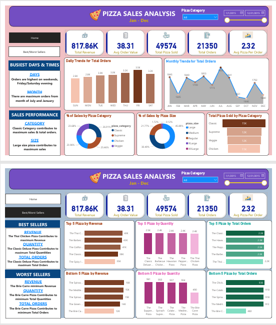

# Pizza Sales Analysis Dashboard

A comprehensive Business Intelligence project analyzing pizza sales data using SQL Server and Power BI to provide actionable insights for business decision-making.

## 📊 Project Overview

This project analyzes pizza sales data from January 2015 to December 2015, covering 48,620 transactions across multiple pizza categories, sizes, and customer orders. The dashboard provides insights into sales performance, customer trends, and product performance.

## 🎯 Key Metrics

- **Total Revenue:** $817.86K
- **Total Orders:** 21,350
- **Total Pizzas Sold:** 49,574
- **Average Order Value:** $38.31
- **Average Pizzas Per Order:** 2.32

## 🛠️ Technologies Used

- **Database:** Microsoft SQL Server 2022 Express
- **Query Tool:** SQL Server Management Studio (SSMS)
- **Visualization:** Microsoft Power BI Desktop
- **Data Analysis:** Python (Jupyter Notebook)
- **Version Control:** Git & GitHub

## 📁 Project Structure

```
pizza-sales-analysis/
│
├── data/
│   └── pizza_sales.csv                    # Raw data file
│
├── sql/
│   └── SQLQuery1.sql                      # SQL queries for data analysis
│
├── powerbi/
│   ├── Pizza_Analysis_Dashboard.pbix      # Power BI dashboard file
│   └── Pizza_Analysis_Dashboard.pdf       # Dashboard export
│
├── python/
│   └── pizza_sales_analysis.ipynb         # Python analysis notebook
│
├── docs/
│   ├── Business_Requirements_Document.docx
│   └── PIZZA_SALES_SQL_QUERIES.docx
│
├── images/
│   └── Pizza Sales Images/                # Dashboard screenshots
│
└── README.md                              # Project documentation
```

## 🔍 Key Insights

### Sales Performance
- **Classic Category** contributes to maximum sales and total orders
- **Large size pizzas** contribute to maximum sales (45.89%)
- Peak sales occur during **weekends** (Friday/Saturday evenings)
- Maximum orders from **July and January**

### Best Sellers
**By Revenue:**
1. The Thai Chicken Pizza
2. The Barbecue Chicken Pizza
3. The California Chicken Pizza
4. The Classic Deluxe Pizza
5. The Spicy Italian Pizza

**By Quantity:**
1. The Classic Deluxe Pizza
2. The Barbecue Chicken Pizza
3. The Hawaiian Pizza
4. The Pepperoni Pizza
5. The Thai Chicken Pizza

### Worst Sellers
- The Brie Carre Pizza shows minimum performance across all metrics

## 📈 Dashboard Features

### Home Page
- KPI Cards (Revenue, Orders, Quantity metrics)
- Daily Trends for Total Orders
- Monthly Trends for Total Orders
- Sales Distribution by Pizza Category
- Sales Distribution by Pizza Size
- Total Pizza Sold by Category
- Date Range Filter
- Category Filter

### Best/Worst Sellers Page
- Top 5 Pizzas by Revenue
- Top 5 Pizzas by Quantity
- Top 5 Pizzas by Total Orders
- Bottom 5 Pizzas by Revenue
- Bottom 5 Pizzas by Quantity
- Bottom 5 Pizzas by Total Orders

## 🚀 Getting Started

### Prerequisites
- Microsoft SQL Server 2022 (Express or higher)
- SQL Server Management Studio (SSMS)
- Power BI Desktop
- Python 3.x (optional, for additional analysis)

### Installation Steps

1. **Clone the repository**
   ```bash
   git clone https://github.com/AlizarKhan62/Pizza-Analysis-with-BI-Report.git
   cd pizza-sales-analysis
   ```

2. **Set up SQL Server Database**
   ```sql
   -- Create database
   CREATE DATABASE pizza_db;
   
   -- Import CSV file using SSMS Import Wizard
   -- Right-click pizza_db → Tasks → Import Data
   ```

3. **Connect Power BI to SQL Server**
   - Open Power BI Desktop
   - Get Data → SQL Server
   - Server: `localhost\SQLEXPRESS`
   - Database: `pizza_db`
   - Load the `pizza_sales` table

4. **Open the Dashboard**
   - Open `Pizza_Analysis_Dashboard.pbix` in Power BI Desktop
   - Refresh data if needed

## 📊 Data Schema

| Column Name | Data Type | Description |
|-------------|-----------|-------------|
| pizza_id | INT | Unique pizza identifier |
| order_id | INT | Order identifier |
| pizza_name_id | VARCHAR | Pizza name code |
| quantity | INT | Number of pizzas |
| order_date | DATE | Date of order |
| order_time | TIME | Time of order |
| unit_price | DECIMAL | Price per pizza |
| total_price | DECIMAL | Total order price |
| pizza_size | VARCHAR | Size (S/M/L/XL/XXL) |
| pizza_category | VARCHAR | Category type |
| pizza_ingredients | TEXT | Pizza ingredients |
| pizza_name | VARCHAR | Full pizza name |

## 🔧 SQL Queries Used

Key SQL queries for analysis:
- Total Revenue calculation
- Order trends by day/month
- Sales by category and size
- Top/Bottom performers
- Average order calculations

See `PIZZA_SALES_SQL_QUERIES.docx` for complete query list.

## 📸 Screenshots




## 🤝 Contributing

Contributions are welcome! Please feel free to submit a Pull Request.


